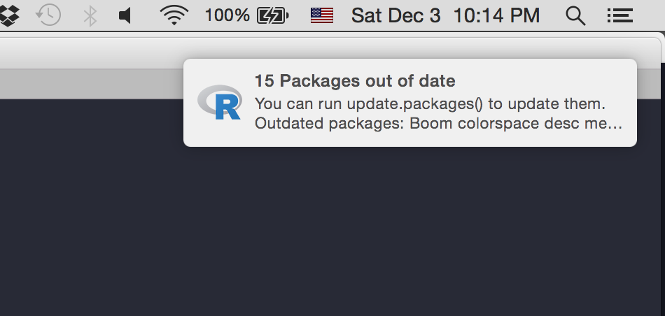

# notifier

> Cross Platform Desktop Notifications

[](https://travis-ci.org/gaborcsardi/notifier)
[](https://ci.appveyor.com/project/gaborcsardi/notifier)
[](https://www.r-pkg.org/pkg/notifier)
[](https://www.r-pkg.org/pkg/notifier)

Send desktop notifications from R, on macOS, Windows and Linux.

## Installation

`notifier` has been [removed from the CRAN repository by request of the maintainer](https://cran.r-project.org/web/packages/notifier/index.html), but version 1.0.0 can still be installed from the CRAN archives with

```r
install.packages("https://cran.r-project.org/src/contrib/Archive/notifier/notifier_1.0.0.tar.gz")
```

To install the latest version from GitHub, however, you may issue the following instead:

```r
remotes::install_github("gaborcsardi/notifier")
```

`notifier` has no R package dependencies, and no system requirements
other than the `notify-send` command line tool on Linux and other
Unix-like systems. `notify-send` is available in the default installation
on most Desktop Linux installations.

## Usage

```r
library(notifier)
notify(
  title = "15 Packages out of date",
  msg = c("You can run update.packages() to update them.",
  "Outdated packages: Boom colorspace desc memuse networkD3",
  "pbapply revealjs rgl rmdformats timevis and 5 more")
)
```





## Thanks

`notifier` uses various tools on the different platform:

* On macOS, it uses `terminal-notifier`:
  https://github.com/julienXX/terminal-notifier
* On Linux and other Unix-like systems it uses `notify-send` from
  `libnotify`.
* On recent Windows systems it uses `toaster`:
  https://github.com/nels-o/toaster
* Older Windows versions it uses `notifu`:
  https://www.paralint.com/projects/notifu

## License

MIT © Gábor Csárdi
